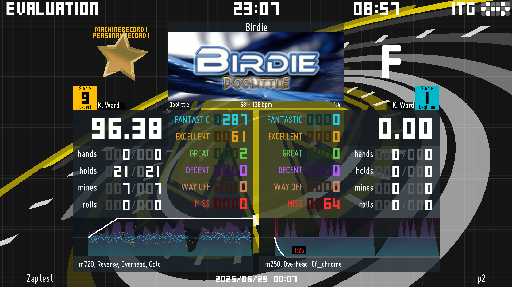

# This is just my personal fork of Zmod.
For the actual Zmod go [here](https://github.com/zarzob/Simply-Love-SM5)

Current build is for ITGMania 1.2.0, Simply Love 5.8.0.
Bruh I forgot that the system image isn't updated yet so I can't even use this now. 

## Screenshot:

## What this fork adds:

  * Reintroduciton of vocalization. Based on [Horseys Simply Love](https://github.com/Horsey-/Horseys-Simply-Love/commit/b7c9a7cef0b7fe0455b0f2bebd6aa7dfedf1fbed).
  * Saving selected vocalization option to player profile.
  * 3D-models and animations for grades from ITG2 and ITG3. (Animations such as how they appear on the result screen are not exact due to differences in themes).
  * Menu option for selecting grade style in advanced options.
  * Saving selected grade style to player profile.
  * Introduce a menu option for selecting combo explosion with choice between ITG and Simply Love.
  * Save selected combo explosion to player profile

## This fork does not:

  * Include my personal collection of judgement fonts, vocalizations, combo fonts, etc.
  (It will however include the ones made by myself or friends, (curretly Rokoroyo))

## Planned additions:
  * Introduce ITG3's Full Combo animations.
  * Allowing for both the judgement counter and visualized pacemaker (or whatever it's called. The IIDX looking one) to be present at the same time.
  * Allow rebinding of folder close command.
  * Reading avatars from USB (I really don't understand why it fails, it may be a thing with my cab???)

## Thing that could be done if I feel like bothering:
  * Make grade style loading less hard coded and instead just read from a common folder. (May be useful, but there's only like 3 of them anyways so why bother?)
  * Same for combo explosion, but same thing where idek if I can find any more to add regardless, so why bother?

# Further...

Feel free to reach out if you want to suggest or change something.
Contributions are welcome.
